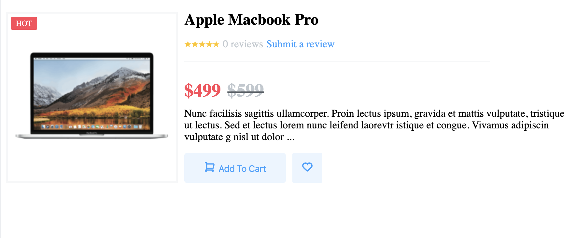
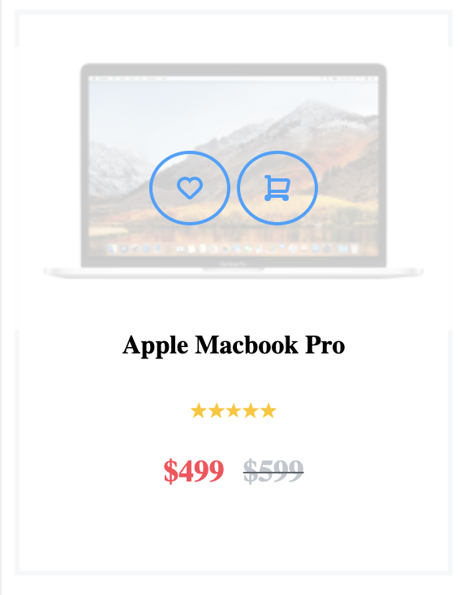

# component-library

The purpose of this repository was create a component library from a mockup.

## Website

[Component Library](https://trusting-shirley-06f0a4.netlify.com)

## Screenshots

## Built With

* Javascript/ReactJS
* HTML
* CSS

## Background

This was the first project that I used react. A lot of time was spent getting used to React's syntax, but the amount of components I created gave me plenty of practice and now I feel confident I using React.

## How to Run

1. Preview the library with Storybook [here](https://trusting-shirley-06f0a4.netlify.com).
2. .

  
## Contributing

If you have any comments or suggestions please feel free to contact me.  

## Authors

* Lorenzo Lucas 
